# American Fastfood Exploratory Data Analysis
:hamburger: Analyzing over 100000 American Fast Food Restaurants Records
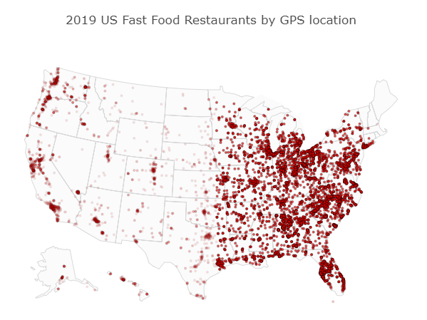
### More Details: go to the [Kaggle Kernel ](https://www.kaggle.com/agilesifaka/detailed-eda-with-visualizations)

### Quick breakdown with some visualizations

#### 1: What are the top 20 recorded fastfood restaurant by count?
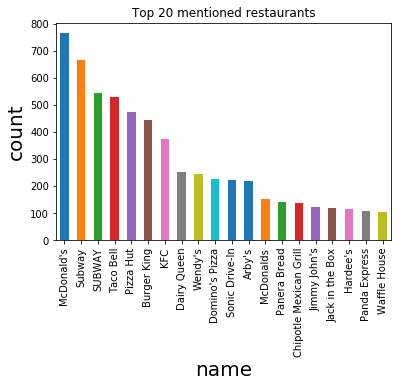  
The bar plot shows that "McDonald's" is the most popular fast food restaurants in the US. However, we can see there exist data entry error because "McDonalds" appearred again in the plot and so does Subway and SUBWAY. Hence, I used **Edit-distance algorithm** to find most similar words and they can possibily be included in the dataset due to error of data entry.

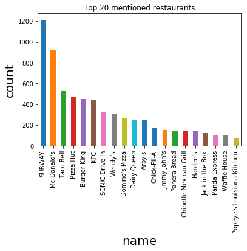  
Looking at the bar plot again with updated, standardized restaurant names, we can observe that "Subway" is the most popular restaurant in the US followed by "Mc Donald's", "Taco Bell", and "Pizza Hut".

#### 2: When are the data recorded and updated?
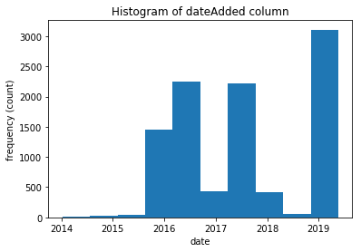 
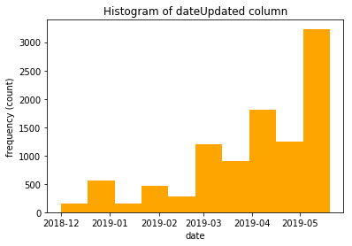  
We have fast food restaurants entries from 2014 to 2019 with most entries from 2019. The dataset has data updated from December 2018 to May 2019.

#### 3: What are the common categories of top 50 mentioned restaurant?
After concatenating restaurant categories with underscore, I used wordcloud to help visualize the categories of top 50 mentioned restaurants. They things in common: American, Take out, and Hamburgers and Hot Dogs.  
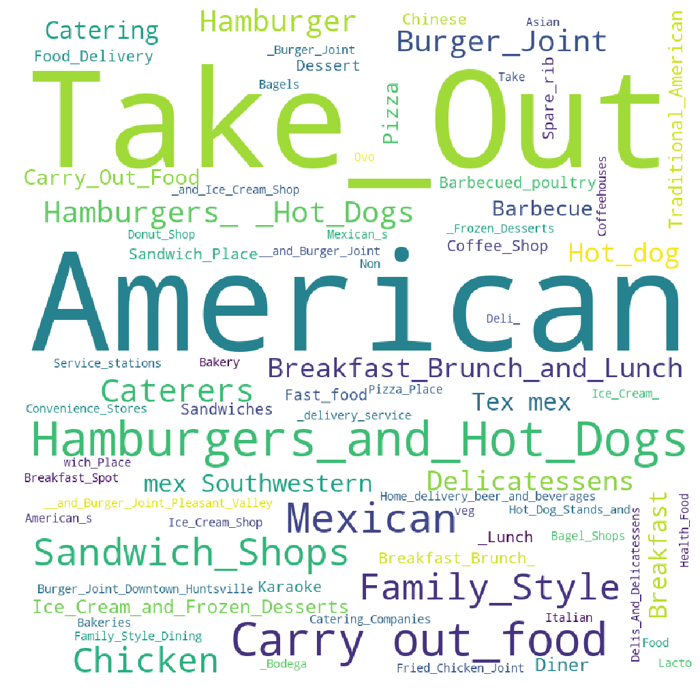

#### 4: What cities are crowded with fast food restaurants?
Columbus is the state capital and the most populous city in the U.S. State of Ohio. With a population of 892,533 as of 2018 estimates, it is the 14th-most populous city in the United States and one of the fastest growing large cities in the nation.
From the below graph, we can see Columbus is populated with fast food restaurants.

#### 5: What states are crowded with fast food restaurants?
Ohio state has the highest number of fast food restaurants record in the dataset.
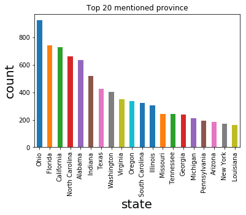

#### 6: What are the proportions of different fast food restaurants in top 3 mentioned cities?
In Columbus, Subway opened highest number of fast food restaurants.  
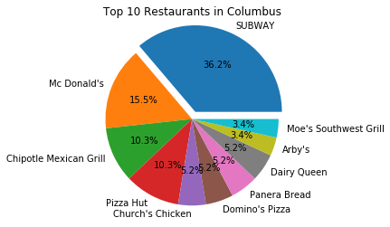

In Indianapolis, Pizza Hut opened highest number of fast food restaurants.  
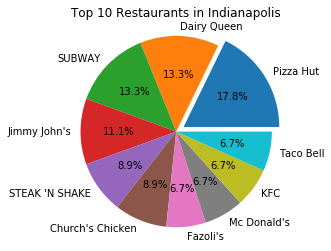

In Birminham, Subway opened highest number of fast food restaurants.
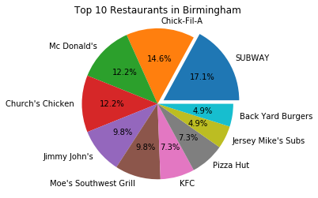

#### Question 7: What's the geospatial perspective of the restaurants in differnt states?
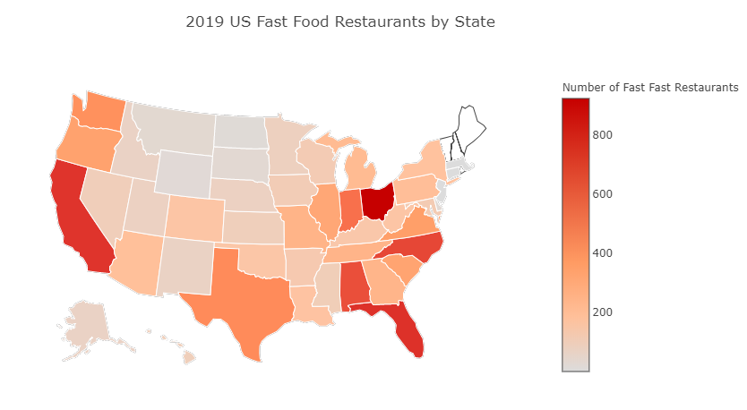

#### Question 8: How are the fast food restaurants scattered?

#### Question 9. Ratio between fast food restaurants opened and population
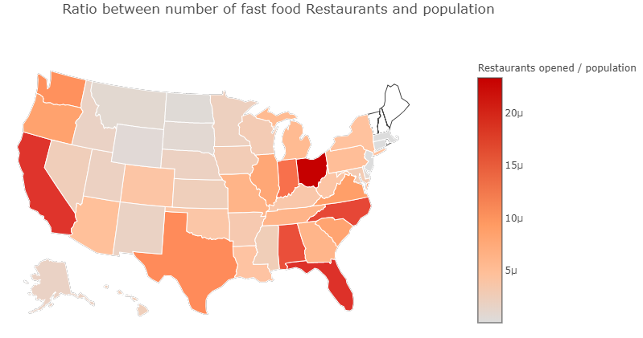
